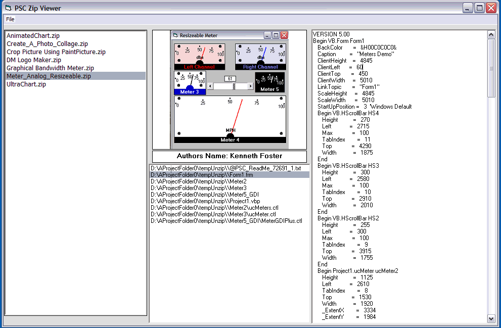



## PSC Zip File Viewer \(update\)

### Description

I know this type of project does'nt get much interest, but it offered a few challenges and besides it was fun to do. Once you have the zipfiles, PSC picture and authors name loaded, you can view the code in the zip file. You can also import a zip and view it also(view only, does'nt include it in the list of zip files.)Hope you like it. Thanks to Rde and Clint LaFever for their code.Update: replaced textbox with richtextbox so code could be colored (syntax).
 
### More Info
 
Zip files, photos and author text file.

Asummes you know how to rename and place files in folders.

View zip file code

Hopefully none.

             |
---                |---
**Submitted On**   |2009-12-19 07:45:40
**By**             |[Kenneth Foster](https://github.com/Planet-Source-Code/PSCIndex/blob/master/ByAuthor/kenneth-foster.md)
**Level**          |Intermediate
**User Rating**    |4.5 (18 globes from 4 users)
**Compatibility**  |VB 6\.0
**Category**       |[Complete Applications](https://github.com/Planet-Source-Code/PSCIndex/blob/master/ByCategory/complete-applications__1-27.md)
**World**          |[Visual Basic](https://github.com/Planet-Source-Code/PSCIndex/blob/master/ByWorld/visual-basic.md)
**Archive File**   |[PSC\_Zip\_Fi21708412202009\.zip](https://github.com/Planet-Source-Code/kenneth-foster-psc-zip-file-viewer-update__1-72746/archive/master.zip)

